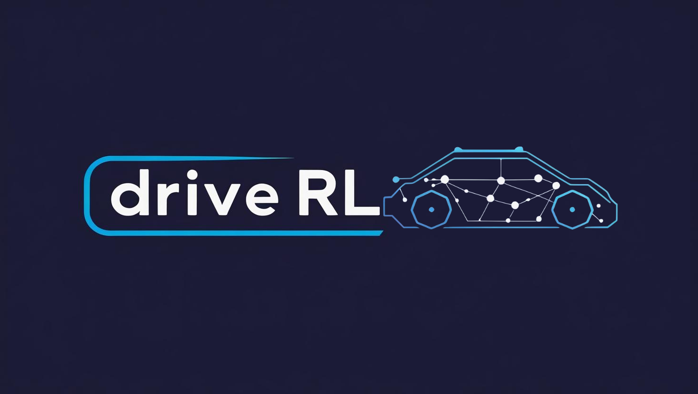
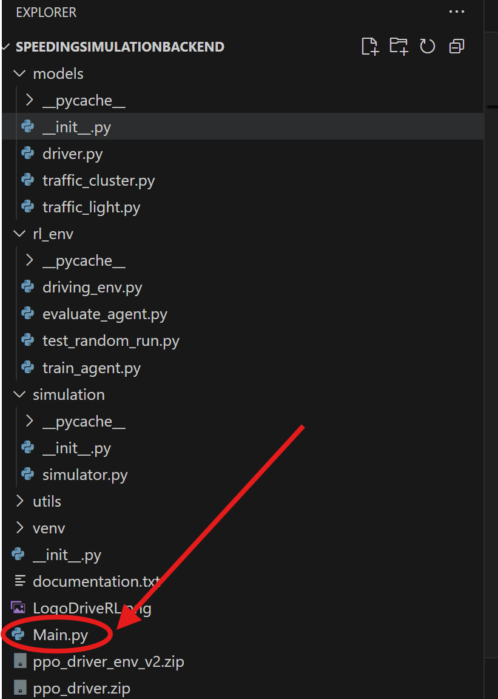
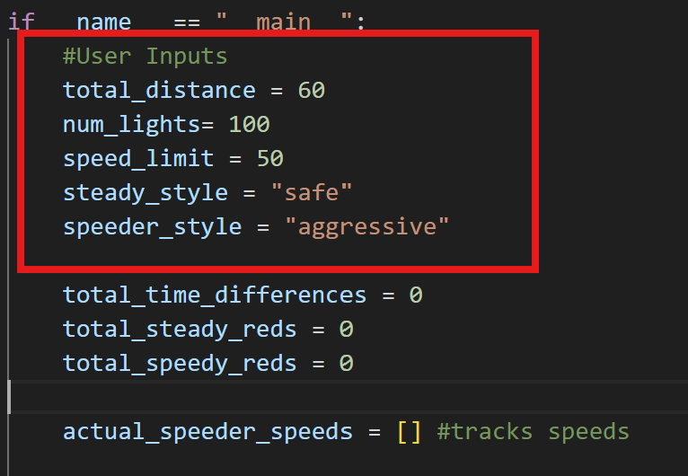
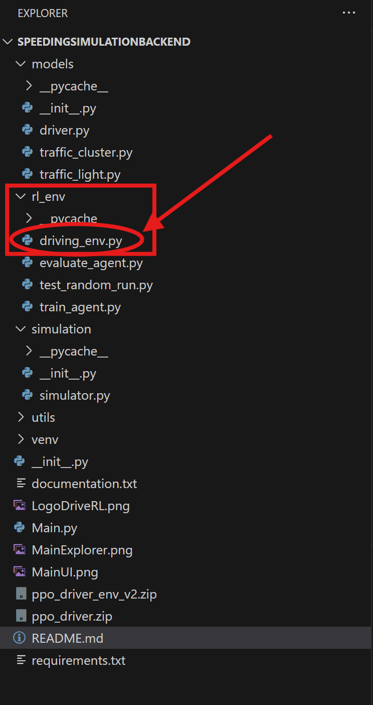
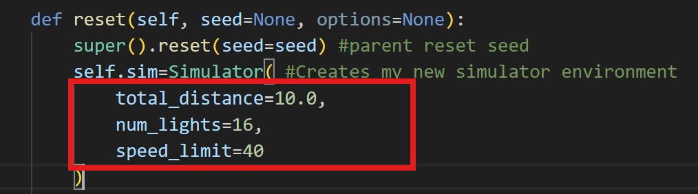
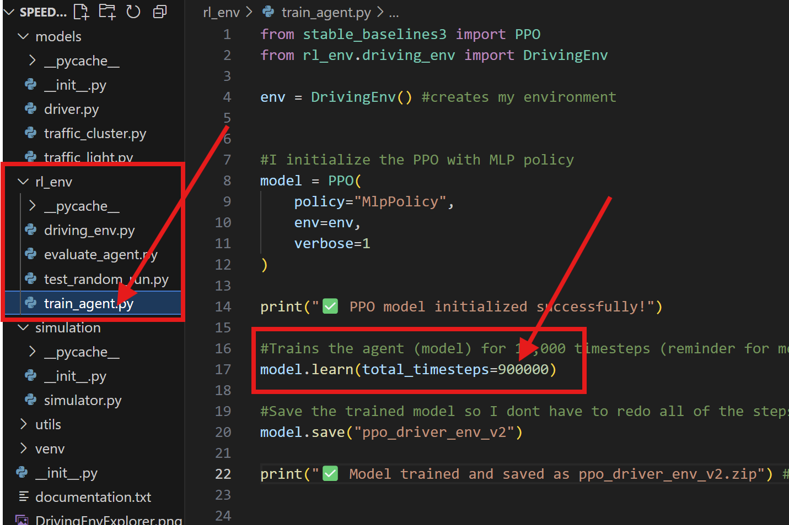

<p align="center">
  
</p>

<h1 align="center">Drive RL</h1>

<p align="center">
  AI Powered driving simulation showing why speeding doesn't save as much time as you'd think. 
</p>

<p align="center">
  
  
  
  
</p>

## 📖 Table of Contents
- [Overview](#overview)
- [Features](#features)
- [Tech Stack](#tech-stack)
- [Installation](#installation)
- [Usage](#usage)
- [Customizing the Simulation](#customizing-the-simulation)
- [AI Training](#training-the-ai-agent)
- [Results](#results)
- [Conclusion](#conclusion)
- [Future Improvements](#future-improvements)
- [License](#license)


## Overview
DriveRL is a reinforcement learning project that simulates different types of drivers- speeders, steady drivers, and AI controlled agents- to demonstrate that speeding rarely saves meaningful time in suburban driving scenarios. It runs in a custom made, random yet realistic traffic environment, where users can adjust inputs (distance, # of lights, and speed limit) to make multiple scenarios.

Originally a simple traffic simulation, DriveRL expanded into a reinforcement learning project:

- **Goal:** Train and teach intelligent driving agents that optimize travel time while abiding by the simulation limits.

- **Approach:** Use reinforcement learning to make smart and adaptive decisions (timing lights, managing acceleration/velocity) to close the gap between reckless and safe driving.

By introducing AI agents, DriveRL goes beyond static simulations, and explores whether smart driving strategies can surpass the time savings of speeding.


## Features

- 🧠 **AI Driver** – Trained using **PPO** with custom reward functions for optimized driving behavior  
- 🚦 **Dynamic Traffic Simulation** – Realistic light cycles and traffic clusters that vary with each run  
- ⚡ **Performance Comparison** – Evaluate **AI agents**, **steady drivers**, and **speeders** side by side  
- 📊 **Real-Time Metrics** – Track **time saved**, **red lights hit**, and other efficiency indicators  
- 🖥️ **Modular Backend** – Fully modular, scalable driving simulation built for flexibility and expansion  
- 🚗 **Human Driver Models** – Steady and speeding driver behaviors fully implemented in the backend

## 🛠️ Tech Stack

- **Language:** Python 3.13  
- **Reinforcement Learning:** Stable-Baselines3 – PPO *(Proximal Policy Optimization)* with MLP policy  
- **Environment:** Custom Gymnasium environment (**DrivingEnv**)  
- **Simulation Engine:**  
  - Custom-built traffic simulation with drivers, traffic lights, and congestion clusters  
  - Multi-file architecture for scalability and modularity  
- **Machine Learning:** PyTorch backend for policy networks  
- **Testing & Monitoring:**  
  - Model evaluation comparing AI driver vs. steady and speeder drivers  
  - Training metrics (rewards, loss, timesteps) logged via Stable-Baselines3  
- **Development Tools:**  
  - Visual Studio Code  
  - Virtual Environment (**venv**)  
  - Markdown for documentation  

## Installation

### 1. Clone the Repository
Type the following commands into your **terminal** to download and enter the project folder:

```bash
git clone link here
cd name here
```

### 2. Create and Activate a Virtual Environment (for Windows)
```bash
python -m venv venv
venv\Scripts\activate    
```
### 3. Install Dependencies

```bash
pip install -r requirements.txt
```
## Usage

### 1. Run the Simulation (Steady and Speeder Drivers)
To test the simulation with only human driver models (steady and speeder), run:
```bash
python main.py --mode simulate
```
The simulation is preset to an environment with total miles = 10.0 (total trip length), number of traffic lights = 16, speed limit = 40 mph. If you wish to customize these, please read [Customizing the Simulation](#customizing-the-simulation) below.

### 2. Train the AI Agent
To train the PPO-based AI driver on the traffic environment:
```bash
python -m rl_env.train_agent
```


- The agent learns driving strategies to optimize travel time and minimize stops at red lights
- Trained models are saved automatically as .zip files in the project folder

### 3. Evaluate the Trained Agent
Once trained, evaluate its performance against both both of the human driver models:

```bash
python -m rl_env.evaluate_agent
```
This runs multiple episodes comparing:
- AI Driver (PPO-Trained)
- Steady Driver (base model)
- Speeder Driver (base model)

And you will be shown the output including:
- Average time
- Number of red lights
- Total rewards

## Customizing the Simulation
You can adjust the simulation settings (distance, number of traffic lights, speed limit) in two main places:

### 1. ```Main.py``` (Human Driver Simulation)
When running steady or speeder drivers, and looking to customize the environment, navigate like so:

<p align="left">
  
</p>

**Once ```Main.py``` is opened, you will see code that looks like this:**

<p align="left">
  
</p>

***OR***
When running training the AI driver, and looking to customize the environment, navigate like so:

### 2. ```rl_env/driving_env.py``` (AI Training Environment)

<p align="left">
  
</p>

**Once ```rl_env/driving_env.py``` is opened, you will see code that looks like this:**
The reset() function in DrivingEnv initializes a new simulation each episode. When called, it creates a new Simulator environment with random spawned lights and clusters and resets the driver. It puts the AI into the "Observation" state.

<p align="left">
  
</p>


Here, you can change the numbers of the distance of the trip, number of traffic lights, speed limit, and the speed style for the steady and speeder driver. You wont be able to change the style for the AI driver, as that is one of the features the AI has, creating its own driving "style"


**Recommended Numbers and Ranges:**

  ```Distance (total_distance)```
- Default: 10.0 miles

- Recommended Range: 5.0 – 50.0 miles

- ⚠️ Too short (< 5) → AI has very few decisions to learn from.

- ⚠️ Too long (> 50) → Slows training and evaluation significantly.

```Number of Traffic Lights (num_lights)```
- Default: 16

- Recommended Range: 5 – 30

- Keeping a balanced ratio: ~1 light every 0.5–1 mile works well.

- ⚠️ Too many → Red lights cluster unrealistically, skewing rewards (AI brain).

- ⚠️ Too few → AI rarely encounters decisions around stopping.

```Speed Limit (speed_limit)```
- Default: 40 mph

- Recommended Range: 30 – 70 mph

- AI is tuned for city-like driving.

- ⚠️ Too low (< 25) → Unrealistic for longer distances.

- ⚠️ Too high (> 70) → May cause aggressive speeds to dominate.


## Training the AI Agent

This project uses **Proximal Policy Optimization (PPO)** with a **Multi-Layer Perceptron (MLP)** policy to train an AI driver.  
PPO is a reinforcement learning algorithm that repeatedly:
1. **Observes** the environment (distance to next light, current speed, light color).
2. **Acts** by deciding to slow down, maintain speed, or speed up.
3. **Learns** from the reward received (time saved or penalties for stopping), updating its policy to improve future decisions.

Over time, the AI driver learns an optimal strategy for minimizing travel time and stopping at fewer red lights.

---

### Train the Model
Run the following command to start training:

```bash
python -m rl_env.train_agent
```

This will:
- Initialize the PPO model
- Train it on the ```DrivingEnv``` environment
- Save the trained model as ```ppo_driver_env_v2.zip``` in the project root

#### Then navigate to ```rl_env/train_agent.py```:


<p align="left">
  
</p>

### Training Duration
100,000 timesteps - 1,000,000 timesteps is recommended for testing and is adjustable as follows:
```model.learn(total_timesteps=1000000)```
For the commands to input to the terminal, refer back to [Usage](#usage). 
You can create as many agents as you'd like, but you will have to replace the file name everywhere you see it in ```train_agent.py``` and ```evaluate_agent.py```, mainly starting at the line ```model.save("ppo_driver_env_v2")``` in ```train_agent.py```.


## Results

After training the PPO agent with 1,000,000 timesteps, its performance was evaluated against two baseline drivers:

- **Steady Driver** → Obeys speed limit
- **Speeder Driver** → Drives aggressively (above speed limit)

### **Performance Comparison**

| Driver Type      | Avg Time (sec) | Avg Red Lights |
|------------------|---------------|----------------|
| **AI PPO Agent**  | 1271.87        | 6.50           |
| Steady Driver     | 1323.09        | 7.40           |
| Speeder Driver    | 1247.27        | 8.30           |

### **Observations**

-  **AI learns to balance speed and traffic lights**, achieving better timing than the steady driver while stopping at fewer red lights.  
-  **Speeder is slightly faster but less efficient**, encountering more red lights than both AI and steady drivers.  
-  **PPO effectively optimizes travel time** without unnecessary speeding, making it a safer and more efficient strategy overall.

If you'd like to hear more about the evaluation, here is a link to a post on LinkedIn written about it: insert link
You may also see the documentation used for some of the numbers under ```documents/documentation.txt```

## Conclusion

From the performance comparisons, one key question arises: **Is speeding really worth it?**  

If you make smart driving decisions (remember, your brain is far more powerful than any AI), you can essentially optimize your time to be **only slightly slower than a speeder**—and in some cases, **even be faster**.  

The answer is **yes**: you can drive safely and efficiently without speeding.  
That’s why **driveRL** is such a valuable tool—it clearly demonstrates that the risks of speeding  
(getting a ticket, causing an accident, injuring yourself or others, damaging your car, etc.)  
are **simply not worth the minimal time saved** (sometimes no time saved).


## Future Improvements

This project can be expanded and improved in several ways:

- **Continuous Training:** Allow the agent to keep learning from real-time or larger-scale simulations for even better decision-making.  
- **Realistic Road Network:** Add multi-lane roads, intersections, and different driving environments to better mimic real-world scenarios.  
- **Visualization Tools:** Create graphs and animations to visualize how the AI adapts its driving strategy over time.  
- **Multiple AI Agents:** Train multiple agents to interact (e.g., multiple AI cars on the same road) to study cooperative or competitive driving behaviors.  
- **Advanced Reward Function:** Fine-tune rewards to further prioritize safety, fuel efficiency, and minimal stops at traffic lights.  
- **Experiment with Other RL Algorithms:** Try algorithms like A2C, SAC, or DQN for comparison with PPO’s performance.  
- **The sky's the limit!**

These enhancements can make the simulation more realistic and stronger, leading to more advanced research into AI-driven traffic optimization. 


## License

This project is licensed under the MIT License – see the [LICENSE](LICENSE) file for details.

### MIT License Summary
- ✅ **Free to use** – Anyone can use, copy, modify, merge, publish, and distribute this project.
- ✅ **Commercial use allowed** – You can use this in proprietary software.
- ❌ **No warranty** – The software is provided "as is" without any warranty.
- 📝 **Credit required** – You must include the copyright notice and permission notice in copies or substantial portions of the software.


Back to the top: [Overview](#overview)
